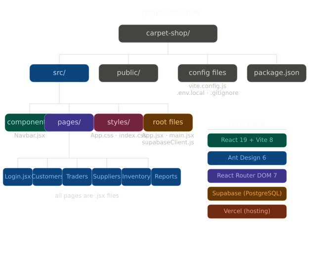

# Carpet Shop Management System

A full-stack business management system built for a carpet retail shop. Handles sales invoices, trader accounts, supplier purchases, inventory tracking, and financial reports — all in a clean Arabic RTL interface.

---

## ✨ Features

### 🛒 Sales (Customers)
- Create invoices with product search
- Editable pricing per invoice (negotiation support)
- Invoice history with full details
- Print-ready invoice layout
- Return processing with automatic inventory restoration

### 🤝 Traders
- Trader-specific pricing per invoice
- Partial payment tracking with payment history
- Outstanding debt overview
- Print invoices with payment records

### 🚚 Suppliers
- Purchase invoice management
- Track amounts owed to each supplier
- Payment installment recording
- Automatic inventory update on purchase

### 📦 Inventory
- Add, edit, and delete products
- Track quantity, selling price, and cost price
- Low stock alerts with configurable minimum threshold
- Real-time sync across all invoice types

### 📊 Reports
- Daily, weekly, and monthly sales reports
- Profit estimation per period
- Debt overview (traders owe you / you owe suppliers)
- Net financial position summary
- Low stock warnings

### 🔐 Authentication
- Login-protected access
- Admin role system
- Auto-redirect for unauthenticated users

---

## 🛠️ Tech Stack

| Layer | Technology |
|--|--|
| Frontend | React 19 + Vite 8 |
| UI Library | Ant Design 6 |
| Routing | React Router DOM 7 |
| Backend & Database | Supabase (PostgreSQL) |
| Hosting | Vercel |

---

## 🗄️ Database Schema

.png)

## 📁 Project Structure



---

## ⚙️ Getting Started

### Prerequisites
- Node.js 18+
- A [Supabase](https://supabase.com) account

### Installation

```bash
git clone https://github.com/MazenMohammed534/carpet-shop.git
cd carpet-shop
npm install
```

### Environment Variables

Create a `.env.local` file in the root:

```env
VITE_SUPABASE_URL=your_supabase_project_url
VITE_SUPABASE_ANON_KEY=your_supabase_anon_key
```

### Run Locally

```bash
npm run dev
```

### Build for Production

```bash
npm run build
```

---

## 🔒 Security

- **Row Level Security (RLS)** enabled on all Supabase tables
- Only authenticated users can read or write any data
- Environment variables used for all sensitive keys — never hardcoded
- Sign-ups disabled in Supabase (single-owner system)
- Protected routes redirect unauthenticated users to login

---

## 🚀 Deployment

This project is deployed on **Vercel** with automatic deployments on every push to `main`.

To deploy your own instance:
1. Fork this repository
2. Connect to [Vercel](https://vercel.com)
3. Add your environment variables in Vercel project settings
4. Deploy!

---

## 📄 License

This project is private and built for personal business use.
